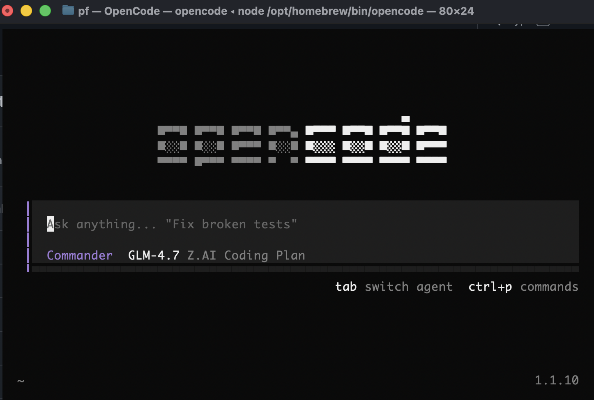

<div align="center">
  
</div>

# OpenCode Orchestrator 🎯

> **Autonomous Multi-Agent Plugin for [OpenCode](https://opencode.ai)**

[](LICENSE)
[](https://www.npmjs.com/package/opencode-orchestrator)

---

## Why I Built This 🤔

**I was frustrated coding with DeepSeek and Z.AI.**

I wanted to achieve the same quality of work as premium models like **Gemini 3 Pro** and **Claude Opus**, but with affordable models.
For developers who chose **budget-friendly subscriptions** instead of expensive plans, I built a multi-agent system that can **autonomously complete** complex engineering tasks even with mid-tier LLMs.

> *"Intelligence is a resource. Orchestrate it."*

---

## What is this?

A **5-agent autonomous architecture** designed to solve complex engineering tasks with high reliability, even on mid-range LLMs.

**Core Philosophy**: Intelligence is a resource. We orchestrate that resource through **Phase-based Workflows** and **Mandatory Environment Scans** to ensure code always fits the project's infrastructure.

> 🦀 **Powered by Rust** — Background tasks and parallel searches run on native Rust binaries for maximum performance.

### Key Features
- **🎯 Autonomous Loop** — Commander runs relentlessly until the mission is complete.
- **🔍 Environment Scan** — Mandatory analysis of Infra (Docker/OS), Stack, and Domain before any code change.
- **🔨 Smart Implementation** — Builder matches existing codebase patterns exactly.
- **🛡️ Rigorous Audit** — Inspector proves success with environment-specific evidence (Builds/Tests/Logs).
- **💾 Persistent Context** — Recorder saves session state to disk, enabling resume at any time.
- **🏗️ Parallel Agents** — Delegated agent execution (`delegate_task`) with sync/async modes.
- **⏳ Background Tasks** — Run long commands (builds, tests) in background and check results later.
- **🔎 mgrep** — Multi-pattern parallel search powered by Rust for blazing-fast codebase analysis.

---

## Installation

```bash
npm install -g opencode-orchestrator
```

Restart OpenCode after installation.

---

## Usage

### 🚀 Method 1: Select Commander via Tab Key (Recommended)

In OpenCode, press `Tab` to open the Agent selection menu. Select **Commander** and type your mission!

<div align="center">
  
  <p><em>Press Tab to select Commander</em></p>
</div>

```
"Fix the login bug in the docker-compose environment"
```

The Commander will:
1. **Survey**: Scan the Docker environment and codebase.
2. **Plan**: Break the fix into steps.
3. **Execute**: Call Builder to fix while matching patterns.
4. **Verify**: Run builds/tests to prove the fix works.
5. **Complete**: Report results with concrete evidence.

### 📋 Method 2: Use /task Command

```bash
/task "Implement user authentication with JWT"
```

> **💡 Tip:** Using the `/task` command makes Commander mode run **2x longer**.
> Use `/task` for complex tasks that need extended processing!

### ⚡ Example: Parallel Execution

Trigger parallel agent execution with prompts like:

```
"Build and test in parallel"
"Implement feature X while reviewing module Y"
"Run linting, tests, and build at the same time"
```

Commander will automatically use `delegate_task` with `background: true` for independent tasks.

**Parallel Execution UI**

When tasks run in parallel, you'll see detailed progress in OpenCode:

```
## 🚀 BACKGROUND TASK SPAWNED

**Task Details**
- **ID**: `task_a1b2c3d4`
- **Agent**: builder
- **Description**: Implement authentication system
- **Status**: ⏳ Running in background (non-blocking)

**Active Tasks**
- Running: 2
- Pending: 1

---

**Monitoring Commands**

Check progress anytime:
- `list_tasks()` - View all parallel tasks
- `get_task_result({ taskId: "task_a1b2c3d4" })` - Get latest result
- `cancel_task({ taskId: "task_a1b2c3d4" })` - Stop this task

---

✓ System will notify when ALL tasks complete. You can continue working!
```

**Terminal Logs**

Monitor parallel tasks in terminal:

```
[parallel] 🚀 SPAWNED task_a1b2c3d4 → builder: Implement authentication
[parallel] 🚀 SPAWNED task_e5f6g7h8 → inspector: Review module
[parallel] ✅ COMPLETED task_e5f6g7h8 → inspector: Review module (45s)
[parallel] 🗑️ CLEANED task_e5f6g7h8 (session deleted)
```

**All Tasks Complete**

When all parallel tasks finish, you'll see:

```
**All Parallel Tasks Complete**

✅ `task_a1b2c3d4` (1m 30s): Implement authentication
✅ `task_e5f6g7h8` (45s): Review module

---

**Retrieval Options**

Use `get_task_result({ taskId: "task_xxx" })` to retrieve full results.

---

**Task Summary**

Total Tasks: 2
Status: All Complete
Mode: Background (non-blocking)
```
"Build and test in parallel"
"Implement feature X while reviewing module Y"
"Run linting, tests, and build at the same time"
```

Commander will automatically use `delegate_task` with `background: true` for independent tasks.

**Parallel Execution UI**

When tasks run in parallel, you'll see detailed progress in OpenCode:

```
╔════════════════════════════════════════════════════════════╗
║  🚀 BACKGROUND TASK SPAWNED                                   ║
╠═════════════════════════════════════════════════════════════╣
║  Task ID:     task_a1b2c3d4                                 ║
║  Agent:       builder                                           ║
║  Description: Implement authentication system                       ║
║  Status:      ⏳ RUNNING (background)                          ║
╠═════════════════════════════════════════════════════════════╣
║  Running: 2     │ Pending: 1                                 ║
╚══════════════════════════════════════════════════════════════╝

---

**Parallel Execution Started**

- 📌 Task ID: `task_a1b2c3d4`
- 🤖 Agent: builder
- 📝 Description: Implement authentication system
- ⏳ Status: Running in background (non-blocking)
- 🔄 Active Tasks: 2 running, 1 pending

**Monitoring**

Check progress anytime with:
- `list_tasks()` - View all parallel tasks
- `get_task_result({ taskId: "task_a1b2c3d4" })` - Get latest result
- `cancel_task({ taskId: "task_a1b2c3d4" })` - Stop this task

System will notify when ALL tasks complete. You can continue working!
```

**Terminal Logs**

Monitor parallel tasks in terminal:

```
[parallel] 🚀 SPAWNED task_a1b2c3d4 → builder: Implement authentication
[parallel] 🚀 SPAWNED task_e5f6g7h8 → inspector: Review module
[parallel] ✅ COMPLETED task_e5f6g7h8 → inspector: Review module (45s)
[parallel] 🗑️ CLEANED task_e5f6g7h8 (session deleted)
```

**All Tasks Complete**

When all parallel tasks finish, you'll see:

```
**All Parallel Tasks Complete**

✅ `task_a1b2c3d4` (1m 30s): Implement authentication
✅ `task_e5f6g7h8` (45s): Review module

---

**Retrieval Options**

Use `get_task_result({ taskId: "task_xxx" })` to retrieve full results.

---

**Task Summary**

Total Tasks: 2
Status: All Complete
Mode: Background (non-blocking)
```
"Build and test in parallel"
"Implement feature X while reviewing module Y"
"Run linting, tests, and build at the same time"
```

Commander will automatically use `delegate_task` with `background: true` for independent tasks.

Monitor parallel tasks in the terminal:
```
[parallel] 🚀 SPAWNED task_a1b2 → builder: Implement feature X
[parallel] 🚀 SPAWNED task_c3d4 → inspector: Review module Y
[parallel] ✅ COMPLETED task_c3d4 → inspector: Review module Y (45s)
[parallel] 🗑️ CLEANED task_c3d4 (session deleted)
```

---

## Agents (5-Agent Architecture)

| Agent | Emoji | Role | Responsibility |
| :--- | :--- | :--- | :--- |
| **Commander** | 🎯 | Orchestrator | Autonomous mission control & delegation |
| **Architect** | 🏗️ | Planner | Task decomposition & strategy correction |
| **Builder** | 🔨 | Developer | Full-stack implementation (Logic + UI) |
| **Inspector** | 🔍 | Quality | 5-point audit & automatic bug fixing |
| **Recorder** | 💾 | Context | Persistent environment & progress tracking |

---

## The Workflow (Progressive Phases)

1. **Phase 0: Triage (Smart)**
   - **Fast Track 🟢**: Simple fixes → Execute instantly (Skip heavy scans).
   - **Deep Track 🔴**: Complex features → Full Environment Scan & Plan.
2. **Phase 1: Environment Scan**
   - Mandatory for Deep Track: Infra/Domain/Stack analysis.
3. **Phase 2: Parallel Planning**
   - Architect creates a DAG of atomic tasks (Scalable Planning).
4. **Phase 3: Execution & Audit**
   - Builder writes code ↔ Inspector verifies with evidence.
5. **Phase 4: Completion**
   - Mission Complete reported with proof of build/test success.

---

## Development

### Quick Start (Local Development)

```bash
# Step 1: Build and link (run this ONCE)
npm run dev:link

# Step 2: Restart OpenCode

# Step 3: Make code changes...

# Step 4: Rebuild and re-link (after code changes)
npm run dev:link

# (Optional) Check link status
npm run dev:status
```

### Development Scripts

```bash
# Build the plugin
npm run build

# Link for local testing (auto-rebuilds)
npm run dev:link

# Unlink from global
npm run dev:unlink

# Check if plugin is linked globally
npm run dev:status

# Test install/uninstall scripts locally
npm run dev:test
```

### Development Workflow

| Step | Command | Description |
|------|----------|-------------|
| 1️⃣ Initial setup | `npm run dev:link` | Build + link for the first time |
| 2️⃣ Test | Open OpenCode | Test your changes |
| 3️⃣ Make changes | Edit code | Modify TypeScript files |
| 4️⃣ Rebuild | `npm run dev:link` | Rebuild + re-link |
| 5️⃣ Repeat | 2-4 | Iterate on changes |
| ❌ Cleanup | `npm run dev:unlink` | Unlink when done |

### Common Scenarios

```bash
# 🔄 Changed code and want to test
npm run dev:link

# 🔍 Check if linked properly
npm run dev:status

# 🧹 Cleanup before committing
npm run dev:unlink

# 🧪 Test install/uninstall scripts
npm run dev:test
```

### Release Scripts

```bash
# Release patch version (0.4.7 → 0.4.8)
npm run release:patch

# Release minor version (0.4.7 → 0.5.0)
npm run release:minor

# Release major version (0.4.7 → 1.0.0)
npm run release:major
```

Each release script:
1. Builds the plugin
2. Bumps version in package.json
3. Creates git tag
4. Pushes to remote
5. Publishes to npm

---

## Uninstall

```bash
npm uninstall -g opencode-orchestrator
```

---

## Docs

- [Architecture & Design](docs/ARCHITECTURE.md) — Detailed system design and agent protocols
- [Plugin Troubleshooting](docs/PLUGIN_TROUBLESHOOTING.md) — Setup and common issues
- [Changelog](CHANGELOG.md) — Version history and updates
- [Changelogs](changelogs/) — Detailed implementation notes per release

---

## License

MIT License. [LICENSE](LICENSE)

---

**Reliability over slop. Environment over assumptions.**
