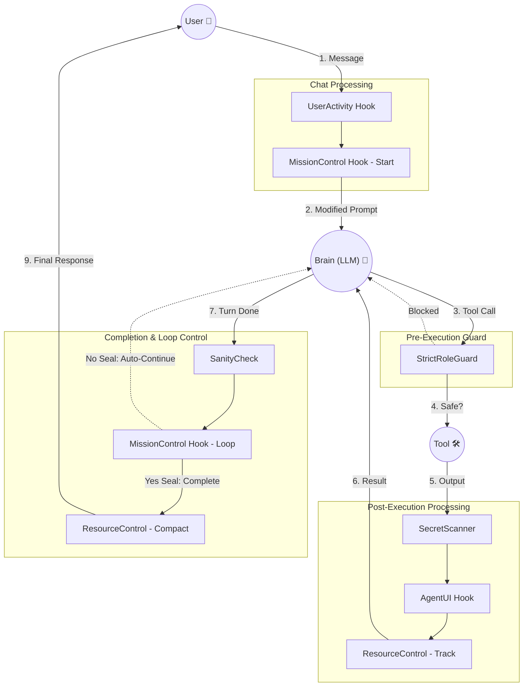

<div align="center">
  
  <h1>OpenCode Orchestrator</h1>

  <p>Autonomous Multi-Agent Orchestration Engine for Software Engineering</p>

  [](LICENSE)
  [](https://www.npmjs.com/package/opencode-orchestrator)
</div>

---

## ⚡ Quick Start

```bash
npm install -g opencode-orchestrator
```

In an OpenCode environment:
```bash
/task "Implement"
```

## Overview

OpenCode Orchestrator manages complex software tasks through **parallel multi-agent execution**. Commander orchestrates Workers and Reviewers to implement and verify code concurrently.

---

## 📊 Workflow

```text
              [User Task Input]
                     │
           ┌─────────▼─────────┐
           │     COMMANDER     │  (Orchestration)
           └─────────┬─────────┘
                     │
           ┌─────────▼─────────┐
           │      PLANNER      │  (Create TODO.md)
           └─────────┬─────────┘
                     │
    ┌────────────────▼────────────────┐
    │   COMMANDER: Parallel Workers   │
    └──────┬─────────┬─────────┬──────┘
           │         │         │
    ┌──────▼──┐ ┌────▼───┐ ┌───▼────┐
    │ WORKER  │ │ WORKER │ │ WORKER │
    └──────┬──┘ └────┬───┘ └────┬────┘
           │         │          │
    ╔══════▼═════════▼══════════▼══════╗
    ║   COMMANDER: Parallel Reviewers  ║
    ╚══════╤═════════╤══════════╤══════╝
           │         │          │
    ┌──────▼──┐ ┌────▼───┐ ┌────▼────┐
    │REVIEWER │ │REVIEWER │ │REVIEWER │
    └──────┬──┘ └────┬───┘ └────┬────┘
           │         │          │
          ═▼═════════▼══════════▼═
          │     SYNC BARRIER     │
          ═══════════╤═══════════
                     │
           ┌─────────▼─────────┐
           │  MASTER REVIEWER  │  (E2E Verification)
           └─────────┬─────────┘
                     │
                [MISSION SEALED]
```




---

## 🚀 Agents

| Agent | Role |
|:------|:-----|
| **Commander** | Orchestrates all agents, manages task flow |
| **Planner** | Creates TODO.md with task breakdown |
| **Worker** | Implements features, writes tests |
| **Reviewer** | Validates code, runs verification |

---

## ✨ Key Features

- **Parallel Execution**: Up to 50 concurrent agent sessions
- **Two-Stage Verification**: Unit review → Master review → Seal
- **Fault Tolerance**: Auto-recovery from failures
- **Context Optimization**: Manages token limits automatically

---

##  Piano Developer's Note

OpenCode Orchestrator was developed to solve the "sequential bottleneck" in AI-assisted coding. By treating agents as distributed processing units rather than just chat interfaces, we aim to provide a more reliable and scalable autonomous engineering experience.

[Full Developer's Note →](docs/DEVELOPERS_NOTE.md)

[System Architecture →](docs/SYSTEM_ARCHITECTURE.md)

---

## 📄 License

MIT License. See [LICENSE](LICENSE) for details.
