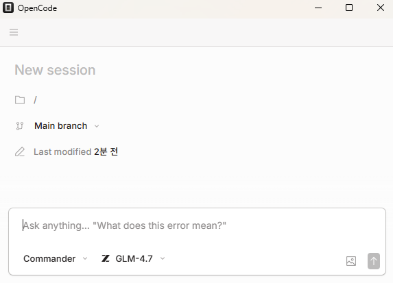

<div align="center">
  
</div>

# OpenCode Orchestrator

> **🚀 Multi-Agent Orchestration Plugin for [OpenCode](https://opencode.ai)**

[](LICENSE)
[](https://www.npmjs.com/package/opencode-orchestrator)
[]()

---

## ⚡ Quick Start

```bash
npm install -g opencode-orchestrator
```

Then in OpenCode:
```bash
/task "Build a REST API with authentication"
```

---

## ⭐ Core Philosophy

> **Humanity lands on an unknown planet. No maps. No guides. Just a mission.**

You don't assume oxygen. You don't guess gravity. You **explore**, **learn**, **adapt**, and **act**.

```
┌──────────────────────────────────────────────────────────────────────────────────────┐
│                                                                                      │
│  🔍 EXPLORE    →    📝 LEARN    →    🔄 ADAPT    →    ⚡ ACT                           │
│                                                                                      │
│  Scan the          Document           Adjust to          Execute the                 │
│  unknown           discoveries        the terrain        mission                     │
│                                                                                      │
└──────────────────────────────────────────────────────────────────────────────────────┘
```

### 👨‍🚀 The Crew

| Agent | Role | Mission |
|:------|:-----|:--------|
| 🎯 **Commander** | The captain | Leads the mission. Delegates specialists. Seals when complete. |
| 📋 **Planner** | The scientist | Maps the terrain. Documents everything. Creates paths to follow. |
| 🔨 **Worker** | The engineer | Builds with local materials. Adapts to the terrain. |
| ✅ **Reviewer** | The inspector | Verifies all structures. Clears the mission for launch. |

### 🛸 The Protocol

| Phase | The Crew's Action |
|:------|:------------------|
| 🔍 **EXPLORE** | *"What world is this?"* — Scan, detect, never assume |
| 📝 **LEARN** | *"Write it down."* — Document for future missions |
| 🔄 **ADAPT** | *"Do it this way here."* — Fit the terrain |
| ⚡ **ACT** | *"Execute."* — Build, test, seal |

### 🌟 Crew Principles

| Principle | In Practice |
|:----------|:------------|
| 🔍 **Never Assume Gravity** | Read `context.md`, detect stack, find actual commands |
| 📝 **Document for Future Missions** | Record patterns, conventions, and findings for reuse |
| 📚 **Evidence Over Memory** | Cite docs, run commands, complete only with proof |
| 🔄 **Adapt to the Terrain** | Behavior evolves based on what we've documented |
| 🤝 **Each Crew Member Has a Role** | Specialists don't overlap — they collaborate |

---

## 🏛️ Architecture

```
            /task "Build REST API"
                     │
     ╔═══════════════╧═══════════════╗
     ║  🎯 COMMANDER — Delegate+Loop ║
     ╚═══════════════╤═══════════════╝
                     │
     ┌───────────────┼───────────────┐
     ▼               ▼               ▼
 ┌───────┐      ┌───────┐      ┌───────┐
 │PLANNER│      │WORKER │      │WORKER │   ← 🔥 50 PARALLEL
 │plan.md│      │auth.ts│      │api.ts │      SESSIONS
 └───────┘      └───────┘      └───────┘
     │               │               │
     └───────────────┼───────────────┘
                     ▼
     ╔═══════════════╧═══════════════╗
     ║      ✅ REVIEWER — Verify     ║
     ╚═══════════════╤═══════════════╝
                     │
            ┌────────┴────────┐
            │ TODO 100%?      │
            │ Issues = 0?     │
            └────────┬────────┘
              No ↙       ↘ Yes
            ♻️ LOOP      🎖️ SEALED
```

---

## ✨ Key Features

| Feature | Description |
|:--------|:------------|
| ⚡ **50 Parallel Sessions** | True multi-threading with isolated contexts |
| 🔥 **Parallel File Builds** | Workers build different files simultaneously |
| 🧩 **Smart Distribution** | One file = one worker. No conflicts |
| 🔗 **Real-Time Sync** | Shared `.opencode/` state across all agents |
| 🛡️ **Auto Verification** | E2E tests, import checks, integration validation |
| 🩹 **Self-Healing** | Auto-recovery with 3 retries per session |
| 🧬 **Adaptive Intelligence** | Agents evolve behavior based on discoveries |

### Self-Healing Details

| Error Type | Recovery Action |
|:-----------|:----------------|
| Tool crash | Inject recovery prompt |
| Rate limit | Exponential backoff + retry |
| Context overflow | Smart compaction |
| Session timeout | Resume from checkpoint |
| Build failure | Loop back, fix, retry |

---

## 📸 Screenshots

<div align="center">
  <p><strong>TUI</strong></p>
  
</div>

<br />

<div align="center">
  <p><strong>Window</strong></p>
  
</div>

---

## 📚 Documentation

- **[System Architecture](docs/SYSTEM_ARCHITECTURE.md)** — Full technical deep-dive

---

## 🎹 Developer's Words

> [Read the full note →](docs/DEVELOPERS_NOTE.md)

---

## 📄 License

MIT License. [LICENSE](LICENSE)
