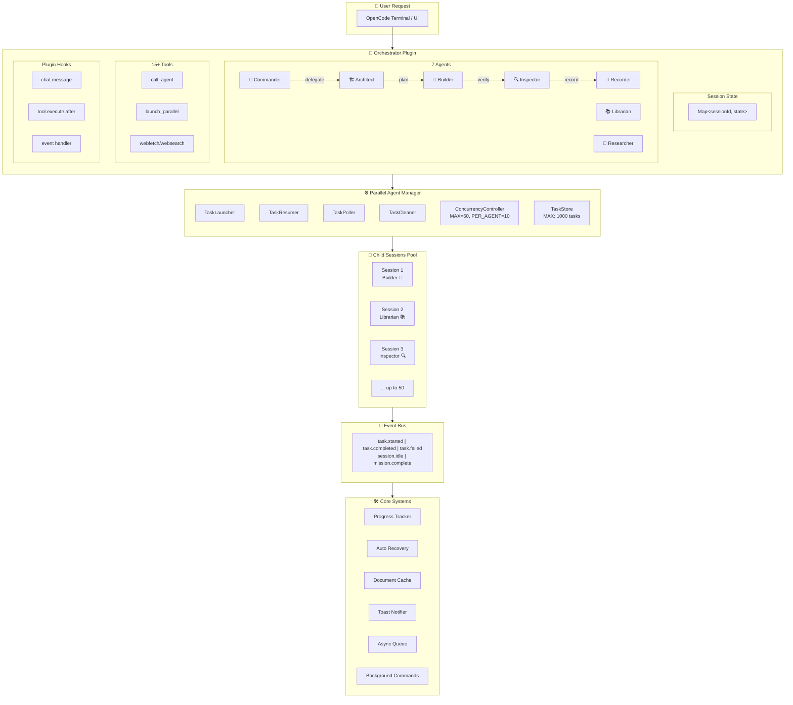

<div align="center">
  
</div>

# OpenCode Orchestrator 🎯

> **Enterprise-Grade Autonomous Multi-Agent Plugin for [OpenCode](https://opencode.ai)**

[](LICENSE)
[](https://www.npmjs.com/package/opencode-orchestrator)
[]()

---

## 🚀 What's New in v0.6.0

**Ultimate Agent Architecture** - Production-ready distributed agent orchestration!

| Feature | Description |
|---------|-------------|
| **♾️ Unlimited Mode** | No step limits - runs until mission complete |
| **🧠 Anti-Hallucination** | Research before coding, verify with docs |
| **⚡ 50x Parallel Sessions** | Massive concurrent task execution |
| **📊 Auto Memory Management** | GC, archiving, zero memory leaks |
| **🔄 Auto Recovery** | Handles rate limits, errors automatically |
| **📡 Event-Driven** | Real-time pub/sub across all components |

---

## 🏛️ System Architecture



---

## 🎯 Key Differentiators

| Capability | OpenCode Orchestrator | Basic Plugins |
|------------|----------------------|---------------|
| **Parallel Sessions** | Up to 50 concurrent | Single session |
| **Memory Management** | Auto GC + disk archiving | Memory leaks |
| **Error Recovery** | Pattern-based auto retry | Crash |
| **Context Sharing** | Parent-child merge | Isolated |
| **Event System** | Real-time pub/sub | None |
| **Task Decomposition** | 3-level hierarchy | Flat |

---

## Installation

```bash
npm install -g opencode-orchestrator
```

Restart OpenCode after installation.

---

## Usage

### 🚀 Two Modes of Operation

| Mode | Trigger | Behavior |
|------|---------|----------|
| **Commander Mode** 🎯 | `/task "mission"` | Full autonomous execution until **MISSION COMPLETE** |
| **Chat Mode** 💬 | Regular conversation | Simple Q&A, no autonomous behavior |

---

### 🎯 Commander Mode - `/task` (Recommended for Real Work)

Use `/task` when you need the AI to **complete a mission autonomously**:

```bash
/task "Fix the login bug in the docker-compose environment"
/task "Add dark mode support to the entire app"
/task "Refactor the API to use TypeScript"
```

**What Commander Mode Does:**
- ♾️ **Runs until done** — Never stops until "MISSION COMPLETE"
- 🧠 **Anti-Hallucination** — Researches docs before coding
- ⚡ **Parallel Execution** — Up to 50 concurrent agents
- 🔄 **Auto-Recovery** — Handles errors automatically
- 📊 **Trriage System** — Adapts strategy to complexity (L1/L2/L3)

<div align="center">
  
  <p><sub><b>/task "mission"</b> triggers full Commander mode</sub></p>
</div>

---

### 💬 Chat Mode - Regular Conversation (Simple Q&A)

Just type normally without `/task` for simple questions:

```
How do I add a loading spinner?
What's the difference between useState and useReducer?
```

**Chat Mode is just regular conversation** — no autonomous execution, no parallel agents, no mission tracking.

---

> **💡 Pro Tip:** Use `/task` for anything that requires multiple steps, file changes, or verification. Use Chat Mode for quick questions.

---

## The 7 Agents

| Agent            | Role         | Responsibility                     |
| :--------------- | :----------- | :--------------------------------- |
| **Commander** 🎯 | Orchestrator | Autonomous mission control         |
| **Architect** 🏗️ | Planner      | Hierarchical task decomposition    |
| **Builder** 🔨   | Developer    | Full-stack implementation          |
| **Inspector** 🔍 | Quality      | Audit, auto-fix & doc verification |
| **Recorder** 💾  | Context      | Progress tracking                  |
| **Librarian** 📚 | Research     | Documentation & API research       |
| **Researcher** 🔬 | Investigation | Pre-task research & analysis      |

---

## 🛠️ Available Tools

| Tool | Description |
|------|-------------|
| `call_agent` | Call another agent synchronously |
| `launch_parallel_agent` | Start parallel async session |
| `check_parallel_task` | Check task status |
| `collect_parallel_results` | Gather completed results |
| `webfetch` | Fetch URL content as Markdown |
| `websearch` | Search web (SearXNG → Brave → DuckDuckGo) |
| `codesearch` | Search open source code patterns |
| `cache_docs` | Manage cached documentation |
| `run_background` | Run command in background |
| `grep_search` / `glob_search` | Fast file search |

---

## 📊 Resource Guarantees

| Resource | Limit | Safety Mechanism |
|----------|-------|------------------|
| Parallel Sessions | 50 | Queue overflow protection |
| Tasks in Memory | 1,000 | Auto GC + disk archive |
| Notifications | 100/parent | FIFO eviction |
| Event History | 100 | Ring buffer |
| Session TTL | 60 min | Auto cleanup |
| Poll Interval | 1 second | Fast completion detection |

---

## 🧪 Test Coverage

```
Test Files:  18 passed
Tests:       211 passed
Duration:    ~4.3s
```

---

## Uninstall

```bash
npm uninstall -g opencode-orchestrator
```

---

## Documentation

- **[System Architecture](docs/SYSTEM_ARCHITECTURE.md)** — Detailed technical docs
- **[OpenCode SDK Reference](docs/OPENCODE_SDK_REFERENCE.md)** — API usage reference
- [Release Notes](docs/releases/) — Version history
- [Troubleshooting](docs/PLUGIN_TROUBLESHOOTING.md)

---

## License

MIT License. [LICENSE](LICENSE)

---

<div align="center">
  <b>Enterprise-scale. Memory-safe. Self-healing. Unlimited.</b>
</div>
