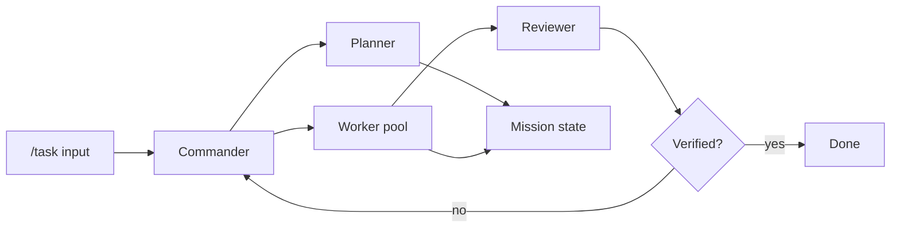

<div align="center">
  
  <h1>OpenCode Orchestrator</h1>
  <p>Multi-agent mission control for OpenCode.</p>

  [](LICENSE)
  [](https://www.npmjs.com/package/opencode-orchestrator)
  <!-- VERSION:START -->
  **Version:** `1.3.6`
  <!-- VERSION:END -->
</div>

---

## 1. Install

```bash
npm install -g opencode-orchestrator
```

The install hook merges OpenCode config instead of replacing it, prefers `opencode.jsonc` when present, preserves existing plugin tuple options, and skips automatic config mutation in CI.

To remove the plugin from OpenCode config:

```bash
npm explore -g opencode-orchestrator -- npm run cleanup:plugin
npm uninstall -g opencode-orchestrator
```

Manual fallback: remove `"opencode-orchestrator"` or `["opencode-orchestrator", {...}]` from the `plugin` array in `opencode.json` or `opencode.jsonc`.

## 2. Configure

OpenCode supports plugin options as `["plugin-name", {...}]` tuples. Use that form for orchestrator-specific settings:

```jsonc
{
  "$schema": "https://opencode.ai/config.json",
  "permission": {
    "question": "allow"
  },
  "plugin": [
    [
      "opencode-orchestrator",
      {
        "agentConcurrency": {
          "commander": 1,
          "planner": 10,
          "worker": 10,
          "reviewer": 10
        },
        "missionLoop": {
          "ledger": true,
          "markdownMemory": true,
          "maxEvidenceEvents": 20
        }
      }
    ]
  ]
}
```

Optional model routing stays in normal OpenCode config. The plugin does not force a model:

```jsonc
{
  "model": "provider/model-id",
  "agent": {
    "commander": {
      "model": "provider/model-id"
    },
    "worker": {
      "model": "provider/stronger-model-id"
    }
  }
}
```

Generated Commander, Planner, Worker, and Reviewer agents inherit global permissions. Same-name user agent config can still override specific model or permission keys.

## 3. Run

Inside OpenCode:

```bash
/task "Implement the requested change and verify it"
```

Mission controls:

1. `/task ...` starts a persisted mission loop under `.opencode/`.
2. `Esc`/OpenCode interrupt is respected by idle guards so the plugin does not immediately re-continue an interrupted turn.
3. `/cancel` and `/stop` deactivate the current mission loop.
4. The default mission iteration ceiling is `1,000,000,000`.

## 4. How It Works


```mermaid
flowchart LR
  U["/task input"] --> C["Commander"]
  C --> P["Planner"]
  C --> W["Worker pool"]
  W --> R["Reviewer"]
  P --> S["Mission state"]
  W --> S
  R --> V{"Verified?"}
  V -- "no" --> C
  V -- "yes" --> D["Done"]
```

| Agent | Purpose |
| --- | --- |
| Commander | Interprets the mission, coordinates agents, and keeps the loop aligned. |
| Planner | Breaks work into ordered steps and tracks dependencies. |
| Worker | Implements scoped file changes with isolated context. |
| Reviewer | Checks completion evidence, tests, and integration risk. |

Runtime evidence is written only when enabled:

| Artifact | Purpose |
| --- | --- |
| `.opencode/mission-ledger.jsonl` | Bounded event trail for mission decisions. |
| `.opencode/docs/brain/scratchpad.md` | Generated Markdown memory surface for active missions. |
| `.opencode/docs/brain/knowledge-map.canvas` | Obsidian-compatible visual map of objective, evidence, and verification nodes. |

## 5. Developer Notes

```bash
npm run build
npx tsc --noEmit
npm test
cargo test --workspace --all-targets
```

Useful references:

1. OpenCode plugins: https://opencode.ai/docs/plugins/
2. OpenCode config: https://opencode.ai/docs/config/
3. OpenCode keybinds: https://opencode.ai/docs/keybinds/
4. Project issues: https://github.com/agnusdei1207/opencode-orchestrator/issues

Contributions are welcome: open an issue or pull request when you find a bug, compatibility gap, or focused improvement.

Config logs:

| Platform | Path |
| --- | --- |
| Unix | `/tmp/opencode-orchestrator.log` |
| Windows | `%TEMP%\opencode-orchestrator.log` |

## 6. License

MIT License. See [LICENSE](LICENSE).
