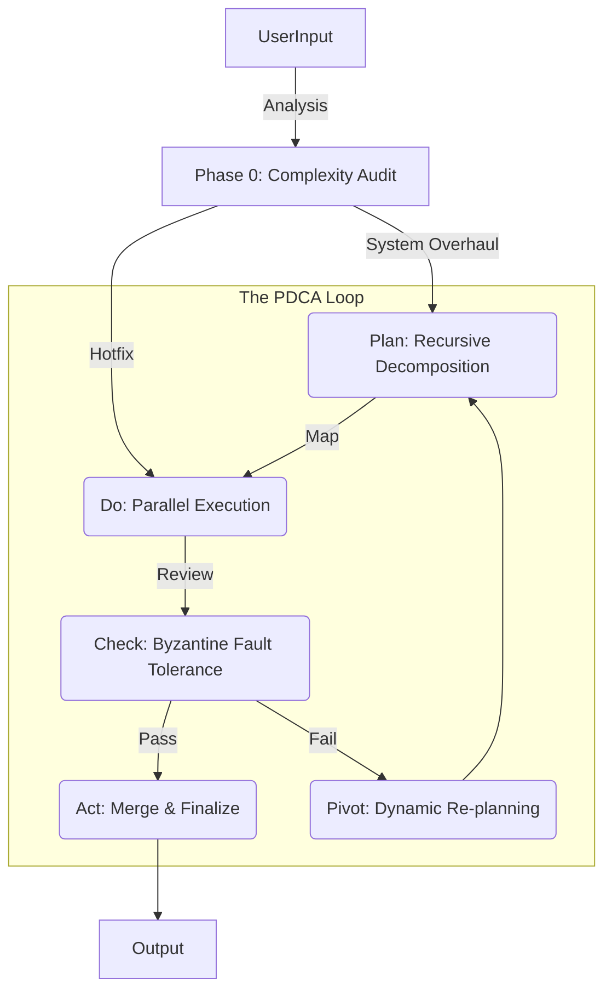

# 🏛️ Distributed Cognitive Architecture (DCA) Deep Dive

> **"We do not build chatbots. We build Deterministic Engineering Layers atop Stochastic Intelligence."**

This document details the internal engineering of **OpenCode Orchestrator**. It explains how we fuse **Operating System principles**, **Distributed Systems theory**, and **Algorithm design** to create a highly reliable coding agent from "affordable" LLMs.

---

## 1. The Core Philosophy: "The Grand Fusion"

The system is designed as a **Virtual Operating System** for cognitive tasks. It **abstracts the primitive 'intelligence' of LLMs into structured and reliable computing resources**, turning probabilistic inference into deterministic engineering outputs.

### The Trinity of Methodologies

| Domain | Concept Applied | Implementation in OpenCode |
| :--- | :--- | :--- |
| **OS Design** | **Process Scheduling** | The **Orchestrator** acts as a Kernel, managing agent "threads" and resource allocation. |
| **Distributed Systems** | **Actor Model** | Agents (Planner, Coder, Reviewer) are independent **Actors** with isolated state and message passing. |
| **Algorithms** | **Dynamic Programming** | We store intermediate task states (Memoization) to allow for **Backtracking** and **Pivoting** upon failure. |

---

## 2. The PDCA Control Loop (The "Heartbeat")

At the core of the Orchestrator runs a strict **PDCA (Plan-Do-Check-Act)** cycle. This is not just a project management term; it is the **main event loop** of the application.

### 2.1. Plan (The "Map" Phase)
- **Agent**: `Planner`
- **Algorithm**: **Divide & Conquer** (Recursive Decomposition)
- **Process**:
    1.  Receives a high-level objective (e.g., "Refactor Auth").
    2.  Breaks it down into sub-components ($O(log n)$ complexity).
    3.  Continues breaking down until tasks are **Atomic** (approx. 20-50 lines of code change).
    4.  **Output**: A Directed Acyclic Graph (DAG) of tasks.

### 2.2. Do (The "Execute" Phase)
- **Agents**: `Coder`, `Searcher`
- **Pattern**: **Parallel Worker Pool**
- **Process**:
    1.  The Orchestrator identifies all tasks with `indegree == 0` (no pending dependencies).
    2.  Spawns parallel execution threads for these tasks.
    3.  **Context Sharding**: Each worker receives *only* the context relevant to its atomic task, simulating "Virtual Memory" to save tokens and reduce noise.

### 2.3. Check (The "Verify" Phase)
- **Agent**: `Reviewer`
- **Theory**: **Byzantine Fault Tolerance**
- **Process**:
    1.  We assume the "Do" phase *will* contain errors (hallucinations).
    2.  The Reviewer acts as a consensus node. It does *not* generate code.
    3.  It validates the output against the **Original Plan** and **Project Standards**.
    4.  **Strict Gate**: Any failure rejects the commit and triggers specific feedback.

### 2.4. Act (The "Correction" Phase)
- **Agent**: `Orchestrator`
- **Algorithm**: **Dynamic Programming / Backtracking**
- **Process**:
    - **Success**: The state is merged into the master branch (File write).
    - **Failure**: The system generates a "Fix Task" and re-queues it.
    - **Critical Failure**: The system performs a **Pivot**, modifying the original Plan based on new findings (Runtime Learning).

---

## 3. Advanced State Management

### 3.1. File-Based State Persistence
We do not rely on the LLM's context window to remember the "State" of the project.
- **RAM**: The LLM's context window (volatile, expensive).
- **Disk**: `.opencode_mission.md` (persistent, cheap).
- **Swap**: `temp_context_*.md` files.

The Orchestrator writes every state change to `.opencode_mission.md`. If the process crashes or the Context Window resets, the system rehydrates its entire state from this file.

### 3.2. Context Sharding (Virtual Memory)
To handle massive repositories with small context windows:
1.  **Searcher** scans 100 files.
2.  Instead of feeding 100 files to the Coder, it creates a `temp_context_auth_logic.md` file.
3.  The Orchestrator passes **only the file path** to the Coder.
4.  The Coder reads *only* that file.
5.  **Result**: Infinite effective context length via paging.

---

## 4. Agent Implementations

### The Orchestrator (Kernel)
- **Role**: Resource Allocator & Scheduler.
- **Responsibility**: Does not write code. Decides *who* does what and *when*.
- **Logic**: Implements the State Machine transitions.

### The Automation (The "Swarm")
- **Mode**: `/task`
- **Behavior**: Autonomous agents working in a hive mind structure, synchronized by the Orchestrator's protocols.

---

## 5. Summary

OpenCode Orchestrator is a **Distributed Computing Application** where the CPU instructions are natural language prompts and the processors are LLM inference calls. By strictly adhering to this architecture, we turn "probabilistic text generation" into "deterministic software engineering".
