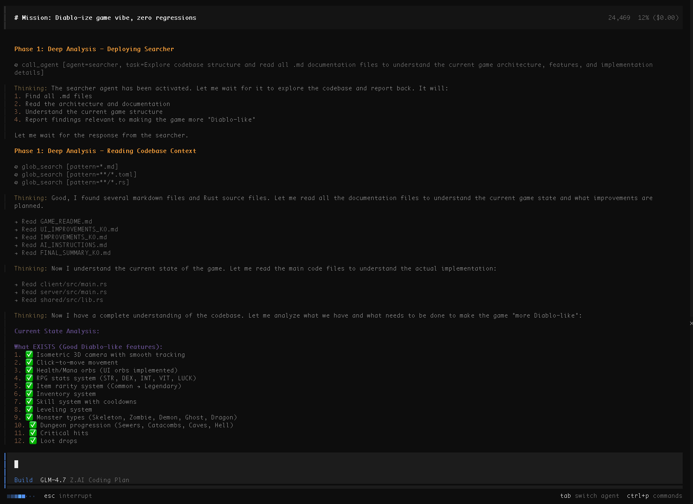

# 🎹 Developer's Words

  

 

> *I believe playing the piano is also a form of orchestration.*
>
> *The harmony of polyphony — multiple voices — and homophony — a single melodic line.*
>
> *Each voice sings its most beautiful song from its own place, yet when combined, they create one grand, beautiful melody. I believe this structure is no different from AI agents.*
