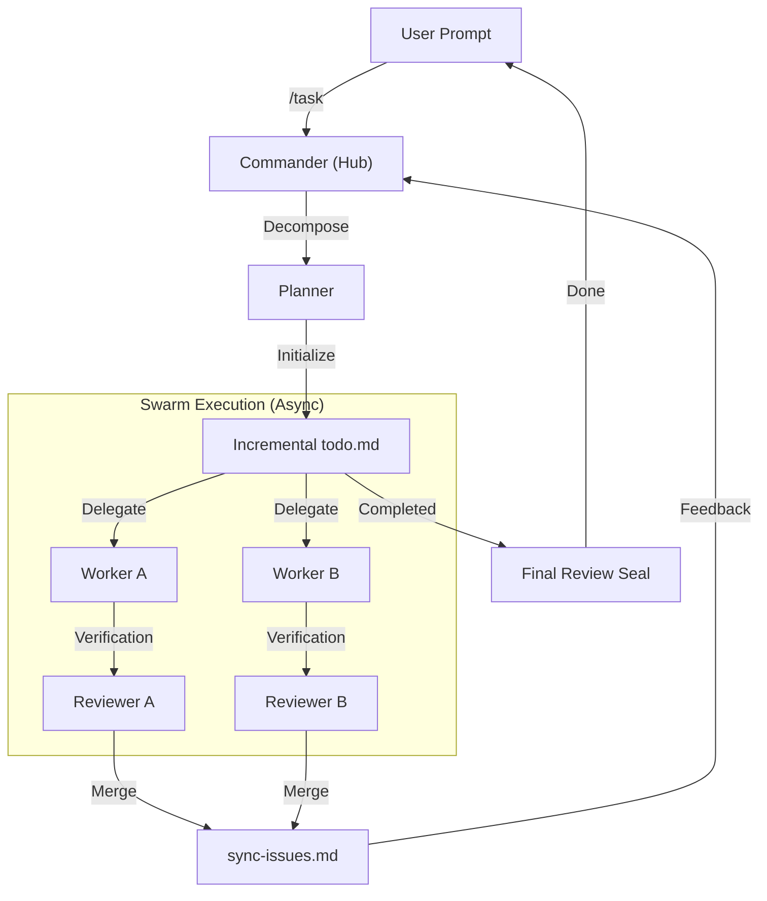

# OpenCode Orchestrator: Comprehensive Cognitive Architecture

OpenCode Orchestrator is a **Persistent-Parallel Cognitive Architecture** designed for autonomous software engineering. It transforms high-level user prompts into structured, verifiable, and parallel execution flows using a multi-agent swarm.

---

## 1. Core Engineering Philosophy: "Explore → Learn → Adapt → Act"

The system operates on an iterative feedback loop where knowledge is the primary currency.
- **EXPLORE**: Detect the environment, repo structure, and existing constraints. NEVER assume state.
- **LEARN**: Permanent documentation. Every discovery is recorded in `.opencode/` to prevent redundant reasoning.
- **ADAPT**: Match the project's style, architectural patterns, and local context.
- **ACT**: Execute with precision. Build, test, and verify until the mission matches the symbolic roadmap.

---

## 2. Structural Architecture (Hub-and-Spoke Topology)

The engine employs an isolated multi-session model to maintain absolute context integrity.

### 2.1. The Commander (Central Hub)
The **Commander** is the master orchestrator. It does not write code directly but manages the mission life-cycle:
- **Session Pooling**: Spawns isolated execution environments for sub-agents.
- **Parallel Coordination**: Manages dependencies between async tasks.
- **State Rehydration**: Ensures mission continuity by syncing state to `.opencode/mission_loop.json`.

### 2.2. Specialized Sub-Agents (The Swarm)
- **Planner (Strategic Lead)**: Translates goals into a symbolic `todo.md`. It focuses on research and roadmapping.
- **Worker (Implementation)**: The high-throughput builder. Specialized in code production and unit test generation.
- **Reviewer (Quality Gate)**: The internal auditor. Performs module-level verification and is the final authority for the "Mission Seal".

---

## 3. Persistent State Management (`.opencode/` Directory)

All system intelligence is persisted in the project root to ensure robustness across reloads.
- `todo.md`: The symbolic roadmap. Acts as the Single Source of Truth for progress.
- `context.md`: The "active project memory" shared across all agents.
- `mission_loop.json`: Technical state of the mission (iterations, session IDs, etc.).
- `work-log.md`: Detailed audit trail of all agent actions.
- `sync-issues.md`: Registry for build errors, lint issues, and test failures.

---

## 4. Advanced Execution Mechanisms

### 4.1. Zero-Payload Initiation (Turbo Mode)
Leverages `system.transform` hooks to inject agent roles on the server side.
- **Benefit**: Reduces initial message size by 90%, preventing payload-related hangs and ensuring the agent never forgets its role.

### 4.2. Self-Healing Rehydration
OpenCode Orchestrator is designed for survival.
- **Mechanism**: Every critical handler (Idle, Done, Message) cross-checks the in-memory state with on-disk artifacts.
- **Result**: If the plugin reloads, it automatically "picks up the thread" and continues the mission as if nothing happened.

### 2.3. Multi-Stage Verification Pipeline (MSVP)
1. **LSP Scan**: Immediate syntax and type-check verification.
2. **Unit Review**: Automatic Reviewer spawning for every completed Worker task.
3. **Integration Gate**: Final check of the mission against the original user intent.

---

## 5. Hook System & Event Flow

| Hook Point | Component | Logical Responsibility |
|:---|:---|:---|
| `experimental.chat.system.transform` | `SystemTransform` | Injects Commander/Agent personality and background task status. |
| `assistant.done` | `ProgressBroadcaster` | Triggers the next mission iteration and broadcasts state to UI. |
| `session.idle` | `TodoContinuation` | Detects when more work is needed and triggers automatic resumption. |
| `tool.pre_execute` | `StrictRoleGuard` | Enforces permissions (e.g., blocking dangerous commands). |

---

## 6. Execution Flow Diagram

---

## 7. Performance & Reliability
- **Throughput**: Up to 10 concurrent sessions (Adaptive).
- **Survival**: 100% mission recovery across plugin restarts via Write-Ahead Logging (WAL).
- **Communication**: Zero-latency ANSI TUI updates through isolated broadcast channels.
