# OpenCode Orchestrator: Sovereign Cognitive Architecture

OpenCode Orchestrator is a **Persistent-Parallel Cognitive Architecture** designed for high-integrity autonomous software engineering. It operates as a sovereign multi-agent swarm, leveraging isolated execution environments (sessions) to transform abstract goals into verified production code.

---

## 1. Core Engineering Philosophy: "E.L.A.A."

The system is governed by a recursion-safe discovery loop designed to minimize hallucinations and maximize reliability.

- **EXPLORE**: Proactive environmental discovery. Agents scan the repository for structural patterns, dependency graphs, and existing build systems. They NEVER assume pre-existing state.
- **LEARN**: Permanent knowledge acquisition. Every discovery is persisted in the `.opencode/` knowledge-base (Symbolic Memory). Learning is equated to documentation.
- **ADAPT**: Context-sensitive execution. Agents adjust their implementation strategies based on the project's unique "lexicon" and architectural style discovered during exploration.
- **ACT**: Deterministic goal pursuit. Guided by the symbolic roadmap (`todo.md`), agents execute tasks, verify outputs via LSP/Tests, and autonomously advance to the next state.

---

## 2. Structural Topology

The engine utilizes a **Hub-and-Spoke Topology** where a central "Commander" manages specialized sub-agents through isolated RPC-capable sessions.

### 2.1. The Commander (Hub)
The Commander acts as the MISSION ORCHESTRATOR. It focuses on high-level state management, delegation logic, and mission-loop continuity.
- **Sovereign Orchestration**: Manages the `ParallelAgentManager` and `SessionPool`.
- **System Transform**: Dynamically modifies the global system prompt to inject role-specific instructions without bloating message history.
- **State Rehydration**: Periodically syncs in-memory session metadata to `.opencode/mission_loop.json` for crash survival.

### 2.2. The Specialized Swarm (Spokes)
| Agent | Role | Specialized Capability |
|:---|:---|:---|
| **Planner** | Architect & Researcher | Symbolic roadmap generation (`todo.md`), dependency analysis, and research documentation. |
| **Worker** | Implementation Engine | High-throughput code generation, unit test authoring, and documentation updates. |
| **Reviewer** | Quality Auditor | Rigid verification against LSP/Lint/Tests. Final gatekeeper for "Mission Completion". |

---

## 3. Atomic State & Synchronization (`.opencode/`)

The directory is the **Engine's Shared Brain**. All agents treat these files as the absolute source of truth.

### 3.1. MVCC Todo Management
To support high-concurrency without data loss, the engine uses an **MVCC (Multi-Version Concurrency Control) + Mutex** strategy for `todo.md`.
- **Logical Versioning**: Every update to `todo.md` is tracked via `todo.version.json`. Updates fail if the base version is stale (Optimistic Locking).
- **Process Mutex**: An in-memory mutex ensures atomic Read-Modify-Write cycles within the orchestrator process, preventing race conditions between concurrent agent threads.
- **Audit Trail**: Every change is logged in `archive/todo_history.jsonl` with cryptographic content hashes for traceability.

### 3.2. Core Artifacts
- **`todo.md`**: Hierarchical symbolic roadmap. The single source of truth for mission progress.
- **`context.md`**: Global project knowledge. A living document updated during the LEARN phase.
- **`mission_loop.json`**: Low-level engine state. Stores iteration counts and crash-recovery metadata.
- **`work-log.md`**: A sequential audit trail of all high-level agent decisions.
- **`sync-issues.md`**: A central registry for build/test failures requiring Planner attention.

---

## 4. Advanced Execution Dynamics

### 4.1. Zero-Payload Turbo-Mode
Leverages the `system.transform` hook to unshift role-specific instructions on the server-side.
- **Result**: Zero latency increase during deep conversation and protection against context-limit fragmentation.

### 4.2. State-Level Session Isolation
Reused sessions in the `SessionPool` are strictly isolated to prevent context leakage.
- **Explicit Reset**: Before a session is returned to the pool, a `compact` command is issued to clear volatile context.
- **Health Monitoring**: Sessions track `lastResetAt` and `health` status (`healthy`, `degraded`, `unhealthy`). Unhealthy sessions are automatically retired.

### 4.3. Multi-Stage Verification Pipeline (MSVP)
1. **LSP/Lint Gate**: Immediate static analysis of every modified file. 
2. **Unit Review**: Automatic Reviewer spawning. For every completed Worker task, a parallel Reviewer session is audited.
3. **Recursive Decomposition**: If a task fails, the Reviewer feeds back to the Planner for precise sub-task decomposition.

---

## 5. Hook Orchestration Engine

The orchestrator utilizes a sophisticated registration system that ensures predictable execution flows.

- **Phase-Based Grouping**: Hooks are categorized into `early`, `normal`, and `late` phases.
- **Priority Metadata**: Fine-grained ordering (0-100) within each phase.
- **Topological Sorting**: The engine automatically resolves dependencies between hooks (e.g., `SecretScanner` always runs after `SanityCheck`) and detects circular dependencies at startup.

| Hook Type | Usage | Key Examples |
|:---|:---|:---|
| `Chat` | Command parsing | `UserActivity`, `MissionControl` |
| `Pre-Tool` | Safety & ACL | `StrictRoleGuard`, `MetricsStart` |
| `Post-Tool` | Validation | `SanityCheck`, `SecretScanner`, `ResourceControl` |
| `Done` | Continuity | `MissionLoopCheck`, `MemoryGate` |

---

## 6. Logic Flow Chart

```mermaid
graph TD
    %% Entry Phase
    User["User Prompt"] -->|/task| MissionControl["MissionControl Hook (Early/10)"]
    MissionControl -->|Atomic Initialize| Disk[".opencode/todo.md"]
    
    %% Planning Phase
    Disk -->|Read vN| Planner["Planner Agent"]
    Planner -->|Update vN+1| Todo["🌳 todo.md (MVCC Protected)"]
    
    %% Execution Cycle
    subgraph "Isolated Parallel Swarm"
        Todo -->|Acquire Session| W1["Worker A (Implementation)"]
        Todo -->|Acquire Session| W2["Worker B (Refactoring)"]
        W1 & W2 -->|Release & Reset| Pool["Session Pool (Isolated)"]
    end
    
    %% Verification Loop
    W1 & W2 -->|MSVP| Reviewer["Reviewer (Auditor)"]
    Reviewer -->|Atomic Update| Todo
    
    %% Monitoring & UI
    Todo -->|Broadcast| TUI["📊 Live Monitor Overlay"]
    
    %% Continuation
    Reviewer -->|Done?| MissionControl
    MissionControl -->|Incomplete| NextLoop["Iteration++ & Inject Prompt"]
    MissionControl -->|Verified| Conclude["🏅 Mission Concluded"]
```

---

## 7. Operational Safety & Resilience
- **Responsive Concurrency**: The engine scales up execution slots after **3 consecutive successes** and scales down aggressively on failures.
- **Self-Healing Rehydration (SHR)**: Survives plugin restarts by cross-referencing volatile maps with on-disk state.
- **Recursion Guard**: Prevents infinite agent delegation with a hard depth limit.
- **Protocol Isolation**: TUI rendering is decoupled from JSON-RPC streams to prevent malformation.

---

## 8. Adaptive Intelligence Loop (Cognitive Resilience)

The orchestrator employs a non-linear feedback system to prevent cognitive stagnation and infinite monitoring loops.

### 8.1. Stagnation Sensing
The engine monitors the **Delta of Implementation** between iteration `N` and `N+1`.
- **Metric**: Comparison of `.opencode/todo.md` completion rates and state file hashes.
- **Trigger**: If `todoProgress` remains identical for 2 consecutive iterations, the session is flagged as **STAGNANT**.

### 8.2. Diagnostic Intervention
Upon stagnation, the engine swaps the standard `CONTINUE_INSTRUCTION` with a High-Integrity **Diagnostic Mandate**:
- **Forced Log Audits**: Mandatory execution of `check_background_task` or `read_file` on active logs.
- **Speculative Pivot**: Agents are forbidden from "monitoring" and must either propose a new strategy or terminate the stalled process.

---

**Version:** 1.2
**Last Updated:** 2026-01-25
**Status:** Validated for Orchestration v1.1.0 - Adaptive Intelligence Active