# System Architecture

## Overview
OpenCode Orchestrator is a **Multi-Agent System** where four specialized agents (Commander, Planner, Worker, Reviewer) collaborate.
As of v1.0.36, it adopts a **Hook-based Event Architecture**, strictly separating core logic from auxiliary features (Security, UI, Resource Management).

---

## 🏛️ Core Structure

### 1. Central Hook Registry
The center of all event processing. Handlers strictly delegate to the Registry instead of containing business logic.

*   **Chat Message**: Handles user input → Executes `SlashCommand`, etc.
*   **Tool Execution**: Handles pre/post tool execution → Executes `Security`, `UI`, `Resource`, etc.
*   **Assistant Done**: Handles turn completion → Executes `MissionLoop`, etc.

### 2. Agent Layer
*   **Commander**: Requirement analysis and strategy (Entry Point).
*   **Planner**: Implementation planning and task distribution (Manages `todo.md`).
*   **Worker**: Code implementation and execution.
*   **Reviewer**: Code quality review and testing.

### 3. State Management (Refactored v1.0.39)
*   **SessionManager**: Centralized controller for all session-related state operations.
    *   **Initialization**: automatically ensures local session objects exist.
    *   **Mission Activation**: Toggles global mission flags via `activateMissionState`.
    *   **Resource Tracking**: Centralized token/cost counting via `updateSessionTokens`.
    *   **Anomaly Management**: Tracks and resets anomaly counts via `recordAnomaly`.
*   **SystemMessages**: Centralized repository for all system prompts, UI templates, and error messages.

---

## 🧩 Hook System Explained

The Hook Architecture moves critical logic (security, monitoring, UI) out of monolithic handlers into modular, event-driven components.

### 1. Core Principles
*   **Event-Driven**: Hooks react to lifecycle events (Chat, Pre-Tool, Post-Tool, Assistant-Done).
*   **Separation of Concerns**: Each hook does exactly one thing (e.g., specific security check, specific logging).
*   **Centralized Registry**: A single `HookRegistry` manages all hooks, ensuring consistent execution order.

### 2. Integration Points (Lifecycle)

| Trigger Point | Event Name | Description | Capabilities |
|---|---|---|---|
| **Chat** | `chat.message` | User sends a message | **Intercept** (block), **Modify** (template), **Process** (side-effects) |
| **Pre-Tool** | `tool.execute.before` | Tool requested by Agent | **Block** (security), **Modify** (args), **Allow** |
| **Post-Tool** | `tool.execute.after` | Tool finished execution | **Analyze** (secrets), **Decorate** (UI), **Track** (tokens), **Inject** (prompts) |
| **Done** | `assistant.done` | Agent turn finished | **Control Loop** (auto-continue), **Finalize** (cleanup) |

### 3. Current Hook Stack

| Hook Name | Role | Trigger | Description |
|-----------|------|---------|-------------|
| **UserActivity** | Utility | Chat | Pauses auto-loops when user speaks. |
| **MissionControl** | Control | Chat & Done | **(Unified)** Handles `/task` start, template expansion, and auto-loop/seal checks. Uses `SessionManager` for state. |
| **StrictRoleGuard** | Security | Pre-Tool | Blocks dangerous commands (`rm -rf` on root) defined in `SecurityPatterns`. |
| **SecretScanner** | Security | Post-Tool | Redacts keys/secrets defined in `SecurityPatterns`. |
| **AgentUI** | UI | Post-Tool | Adds `[PLANNER]` headers & tracks IDs. Uses `SystemMessages` for formatting. |
| **ResourceControl** | System | Post/Done | Delegates token tracking to `SessionManager`. Triggers Memory Compaction. |
| **SanityCheck** | Validation | Post/Done | Warns on empty outputs or loops. Uses `SessionManager` for anomaly counts. |

---

## 🚦 Hook Action Flow (Visual Feel)

Imagine the OpenCode Orchestrator as an automated factory. Hooks are the **Checkpoints and Sensors** placed along the pipeline.

### 1. Life of a User Request

| Stage | Activity | Hook Involved | What Happens? |
|:---:|---|:---:|---|
| **1. Input** | **User:** `"/task build"` | **MissionControl (Chat)** | 1. Detects `/task`. <br> 2. Sets Global Mission Active. <br> 3. Modifies text to "Start mission...". |
| **2. Reasoning** | **Agent:** "I must delete root." | *(Internal)* | Agent decides to run `rm -rf /`. |
| **3. Checkpoint** | **Tool Request:** `run("rm -rf /")` | **StrictRoleGuard** | 🚨 **BLOCK!** "Forbidden command." <br> Agent gets error immediately. |
| **4. Action** | **Tool Request:** `ls -R` | **StrictRoleGuard** | ✅ **ALLOW**. Tool executes. |
| **5. Result** | **Tool Output:** "API_KEY=sk-123..." | **SecretScanner** | 🕵️ **MODIFY**. Output becomes "API_KEY=***". |
| **6. Decoration** | **Display:** Showing to User | **AgentUI** | 🎨 **DECORATE**. Adds `[P] PLANNER Working...` header. |
| **7. Resource** | **Telemetry:** Token Counting | **ResourceControl** | 📊 **TRACK**. Adds tokens to stats. <br> If >85% full, schedules compaction. |
| **8. Completion** | **Agent Done:** "I finished listing." | **MissionControl (Done)** | 🔄 **LOOP**. Checks `<mission_seal>`. <br> If missing, auto-injects "Continue working!". |

### 2. Flow Diagram (Detailed)

This diagram illustrates the complete lifecycle including the **Mission Control** Loop.

```mermaid
graph TD
    %% Nodes
    User(("User 👤"))
    LLM(("Brain (LLM) 🧠"))
    Tool(("Tool 🛠️"))
    
    %% 1. Chat Processing
    subgraph Chat_Processing [Chat Processing]
        UserAct[UserActivity Hook]
        MissionChat[MissionControl Hook - Start]
    end

    %% 2. Pre-Execution
    subgraph Pre_Execution [Pre-Execution Guard]
        RoleGuard[StrictRoleGuard]
    end

    %% 3. Post-Execution
    subgraph Post_Execution [Post-Execution Processing]
        Scanner[SecretScanner]
        UI[AgentUI Hook]
        Resource[ResourceControl - Track]
    end

    %% 4. Completion
    subgraph Completion [Completion & Loop Control]
        Sanity[SanityCheck]
        MissionDone[MissionControl Hook - Loop]
        ResourceComp[ResourceControl - Compact]
    end

    %% Flow Connections
    User -->|1. Message| UserAct
    UserAct --> MissionChat
    MissionChat -->|2. Modified Prompt| LLM
    
    LLM -->|3. Tool Call| RoleGuard
    RoleGuard -->|4. Safe?| Tool
    RoleGuard -.->|Blocked| LLM
    
    Tool -->|5. Output| Scanner
    Scanner --> UI
    UI --> Resource
    Resource -->|6. Result| LLM
    
    LLM -->|7. Turn Done| Sanity
    Sanity --> MissionDone
    
    MissionDone -.->|No Seal: Auto-Continue| LLM
    MissionDone -->|Yes Seal: Complete| ResourceComp
    ResourceComp -->|9. Final Response| User
```



---

## 🛠️ Developer Guide: Adding a New Hook

1.  **Create File**: `src/hooks/custom/my-new-hook.ts`
2.  **Implement Interface**:
    ```typescript
    import { PostToolUseHook, HOOK_ACTIONS } from "../types";
    
    export class MyNewHook implements PostToolUseHook {
        name = "MyNewHook";
        async execute(ctx, tool, input, output) {
            return { action: HOOK_ACTIONS.CONTINUE };
        }
    }
    ```
3.  **Register**: Add `registry.registerPostTool(new MyNewHook())` in `src/hooks/index.ts`.
