# OpenCode Orchestrator: Sovereign Cognitive Architecture

OpenCode Orchestrator is a **Persistent-Parallel Cognitive Architecture** designed for high-integrity autonomous software engineering. It operates as a sovereign multi-agent swarm, leveraging isolated execution environments (sessions) to transform abstract goals into verified production code.

---

## 1. Core Engineering Philosophy: "E.L.A.A."

The system is governed by a recursion-safe discovery loop designed to minimize hallucinations and maximize reliability.

- **EXPLORE**: Proactive environmental discovery. Agents scan the repository for structural patterns, dependency graphs, and existing build systems. They NEVER assume pre-existing state.
- **LEARN**: Permanent knowledge acquisition. Every discovery is persisted in the `.opencode/` knowledge-base (Symbolic Memory). Learning is equated to documentation.
- **ADAPT**: Context-sensitive execution. Agents adjust their implementation strategies based on the project's unique "lexicon" and architectural style discovered during exploration.
- **ACT**: Deterministic goal pursuit. Guided by the symbolic roadmap (`todo.md`), agents execute tasks, verify outputs via LSP/Tests, and autonomously advance to the next state.

---

## 2. Structural Topology

The engine utilizes a **Hub-and-Spoke Topology** where a central "Commander" manages specialized sub-agents through isolated RPC-capable sessions.

### 2.1. The Commander (Hub)
The Commander acts as the MISSION ORCHESTRATOR. It focuses on high-level state management, delegation logic, and mission-loop continuity.
- **Sovereign Orchestration**: Manages the `ParallelAgentManager` and `SessionPool`.
- **System Transform**: Dynamically modifies the global system prompt to inject role-specific instructions without bloating message history.
- **State Rehydration**: Periodically syncs in-memory session metadata to `.opencode/mission_loop.json` for crash survival.

### 2.2. The Specialized Swarm (Spokes)
| Agent | Role | Specialized Capability |
|:---|:---|:---|
| **Planner** | Architect & Researcher | Symbolic roadmap generation (`todo.md`), dependency analysis, and research documentation. |
| **Worker** | Implementation Engine | High-throughput code generation, unit test authoring, and documentation updates. |
| **Reviewer** | Quality Auditor | Rigid verification against LSP/Lint/Tests. Final gatekeeper for "Mission Completion". |

---

## 3. Persistent Memory & State Synchronization (`.opencode/`)

The directory is the **Engine's Shared Brain**. All agents are instructed to treat these files as the absolute source of truth.

- **`todo.md`**: Hierarchical symbolic roadmap. Managed by `TodoManager` for atomic, incremental updates.
- **`context.md`**: Global project knowledge. A living document updated during the LEARN phase.
- **`mission_loop.json`**: Low-level engine state. Stores iteration counts, active session IDs, and start-up metadata.
- **`work-log.md`**: A sequential audit trail of all high-level agent decisions and tool results.
- **`sync-issues.md`**: A central registry for failures. Any build/test error is logged here for the Planner to analyze.
- **`archive/tasks/`**: Write-Ahead Logs (WAL) for every parallel task, allowing the engine to resume background work after a plugin restart.

---

## 4. Advanced Execution Dynamics

### 4.1. Zero-Payload Turbo-Mode
Instead of sending 20k tokens of instructions with every user prompt, we use the `system.transform` hook.
- **Mechanism**: The hook intercepts the server's system prompt and unshifts the modular `Commander` system instructions.
- **Result**: Zero latency increase during deep conversation. Agents can maintain "Commander" persona for thousands of turns without context-limit fragmentation.

### 4.2. Persistent-Autonomous Rehydration (S.H.R.)
Designed for **Total Fault Tolerance**.
- **SHR (Self-Healing Rehydration)**: During every event (Idle, Completion, Done), the engine cross-references the volatile `state` map with the persistent `.opencode` state.
- **Logic**: If `sessions.has(id)` is false but `mission_loop.json` exists, the engine re-instantiates the session object and re-activates mission flags.

### 4.3. Multi-Stage Verification Pipeline (MSVP)
1. **LSP/Lint Gate**: Immediate static analysis of every modified file. 
2. **Unit Review**: Automatic Reviewer spawning. For every completed Worker task, a parallel Reviewer session is launched to audit the delta.
3. **Recursive Decomposition**: If a task fails verification, the Reviewer feeds back to the Planner to decompose the fix into sub-tasks.

---

## 5. Hook Ecosystem & Protocol Integration

| Hook Name | Lifecycle Point | Implementation Detail |
|:---|:---|:---|
| `system.transform` | Pre-Turn | Injects modular fragments (`CORE_PHILOSOPHY`, `AUTO_MANDATE`, `SEARCH_TOOLS`) and background task status markers. |
| `assistant.done` | Post-Response | Triggers the `MissionControlHook` to evaluate loop continuation without blocking the turn-closing protocol. |
| `session.idle` | Inactivity | Invokes `TodoContinuation` to detect remaining items and trigger the "Resuming in 3s..." workflow. |
| `tool.pre_execute` | Pre-Tool | Enforces the `StrictRoleGuard`, preventing Worker agents from performing destructive root operations. |

---

## 6. Logic Flow Chart

```mermaid
graph TD
    %% Entry Phase
    User["User Prompt"] -->|Slash Command| MissionControl["MissionControl Hook"]
    MissionControl -->|Initialize| Disk[".opencode/mission_loop.json"]
    
    %% Planning Phase
    Disk -->|Read| Planner["Planner Agent"]
    Planner -->|Generate| Todo["🌳 todo.md (Symbolic State)"]
    
    %% Execution Cycle
    subgraph "Parallel Swarm Execution"
        Todo -->|Delegate Background| Worker1["Worker A (Implementation)"]
        Todo -->|Delegate Background| Worker2["Worker B (Refactoring)"]
    end
    
    %% Verification Loop
    Worker1 & Worker2 -->|Trigger| MSVP["Multi-Stage Verification (Reviewer)"]
    MSVP -->|Pass| Success["Mark [x] in todo.md"]
    MSVP -->|Fail| Log["Write to sync-issues.md"]
    
    %% Monitoring & UI
    Log & Success -->|Broadcast| TUI["📊 Terminal Monitor Overaly"]
    
    %% Continuation
    Success -->|Done?| MissionControl
    MissionControl -->|No| NextLoop["Iteration++ & Re-inject Prompt"]
    MissionControl -->|Yes| Conclude["🏅 Conclude Mission"]
```

---

## 7. Operational Safety & Resource Shielding
- **Recursion Guard**: Maximum task depth is enforced (Default: 5). Worker agents are denied further delegation to prevent infinite fractal spawning.
- **Rate-Limit Jitter**: Parallel launcher applies randomized back-off delays when spawning multi-agent sessions to avoid server-side rate-limiting.
- **Protocol Isolation**: TUI updates are strictly isolated from the bridge protocol to prevent JSON-RPC malformation.
