# System Architecture

## Overview
OpenCode Orchestrator is a **Multi-Agent System** where four specialized agents (Commander, Planner, Worker, Reviewer) collaborate.
As of v1.0.36, it adopts a **Hook-based Event Architecture**, strictly separating core logic from auxiliary features (Security, UI, Resource Management).

---

## 🏛️ Core Structure

### 1. Central Hook Registry
The center of all event processing. Handlers strictly delegate to the Registry instead of containing business logic.

*   **Chat Message**: Handles user input → Executes `SlashCommand`, etc.
*   **Tool Execution**: Handles pre/post tool execution → Executes `Security`, `UI`, `Resource`, etc.
*   **Assistant Done**: Handles turn completion → Executes `MissionLoop`, etc.

### 2. Agent Topology (Star / Hub-and-Spoke)

The system operates on a **Commander-Centric Flat Topology**, explicitly avoiding recursive (fractal) nesting to ensure stability and controllable context depth.

*   **Commander (Hub)**: The central orchestrator. It runs a linear control loop: analyzing requirements, planning, and spawning parallel tasks. It is the **only** agent authorized to spawn sub-agents.
*   **Spokes (Parallel Agents)**:
    *   **Planner**: Creates the `TODO.md` roadmap.
    *   **Worker**: Implements code in parallel execution slots (managed by `ConcurrencyController`).
    *   **Reviewer**: Verifies code quality via MSVP (Multi-Stage Verification Pipeline).
    
**Execution Model: Linear Control, Parallel Execution**
The Commander maintains a single, coherent narrative (Linear) but offloads heavy lifting to Workers (Parallel). This "Fan-Out, Fan-In" approach enables multiple files to be edited simultaneously without the Commander losing context.

### 3. State Management (Refactored v1.0.39)
*   **SessionManager**: Centralized controller for all session-related state operations.
    *   **Initialization**: automatically ensures local session objects exist.
    *   **Mission Activation**: Toggles global mission flags via `activateMissionState`.
    *   **Resource Tracking**: Centralized token/cost counting via `updateSessionTokens`.
    *   **Anomaly Management**: Tracks and resets anomaly counts via `recordAnomaly`.
*   **SystemMessages**: Centralized repository for all system prompts, UI templates, and error messages.

---

## 🧩 Hook System Explained

The Hook Architecture moves critical logic (security, monitoring, UI) out of monolithic handlers into modular, event-driven components.

### 1. Core Principles
*   **Event-Driven**: Hooks react to lifecycle events (Chat, Pre-Tool, Post-Tool, Assistant-Done).
*   **Separation of Concerns**: Each hook does exactly one thing (e.g., specific security check, specific logging).
*   **Centralized Registry**: A single `HookRegistry` manages all hooks, ensuring consistent execution order.

### 2. Integration Points (Lifecycle)

| Trigger Point | Event Name | Description | Capabilities |
|---|---|---|---|
| **Chat** | `chat.message` | User input | **Intercept**, **Modify**, **Process** |
| **Pre-Tool** | `tool.execute.before` | Tool request | **Block**, **Modify**, **Allow** |
| **Post-Tool** | `tool.execute.after` | Tool finished | **Analyze**, **Decorate**, **Track**, **Inject** |
| **Done** | `assistant.done` | Turn finished | **Control Loop**, **Finalize** |

---

## 📋 Verification System (v1.0.58+)

The orchestrator enforces a **hard verification gate** before allowing mission completion. This prevents premature sealing and ensures all tasks are truly complete.

### 1. Verification Checklist

Agents create a verification checklist at `.opencode/verification-checklist.md`:

```markdown
# Verification Checklist

## Code Quality
- [x] **Lint**: No lint errors
- [x] **Type Check**: Type checking passes

## Unit Tests
- [x] **Unit Tests**: All unit tests pass

## Build Verification
- [x] **Build**: Project builds successfully

## Infrastructure (Environment-specific)
- [x] **Docker Build**: Container builds successfully
```

### 2. Verification Flow

```
LLM outputs <mission_seal>SEALED</mission_seal>
                    │
                    ▼
         ┌─────────────────────┐
         │ verifyMissionCompletion() │
         └──────────┬──────────┘
                    │
    ┌───────────────┴───────────────┐
    ▼                               ▼
Checklist exists?               No checklist?
    │                               │
    ▼                               ▼
ALL items [x]?              ALL TODO items [x]?
+ sync-issues empty?        + sync-issues empty?
    │                               │
    ▼                               ▼
PASS → STOP + Notification   FAIL → INJECT (loop back)
```

### 3. Key Features

| Feature | Description |
|---------|-------------|
| **Environment Agnostic** | Works with any project structure |
| **Flexible Categories** | Code quality, tests, build, runtime, infrastructure |
| **LLM Discovery** | Agent discovers and adds project-specific checks |
| **System Enforced** | Hook-level gate rejects premature SEAL |
| **Dual Notification** | TUI Toast + OS Notification on success |

### 4. File Structure

```
src/shared/verification/
├── constants/
│   ├── checklist.ts      # CHECKLIST.FILE, MIN_ITEMS
│   ├── patterns.ts       # Regex patterns for parsing
│   └── categories.ts     # CATEGORY_ID, LABELS, ICONS
├── types/
│   └── checklist-category.ts
└── interfaces/
    ├── checklist-item.ts
    ├── verification-result.ts
    └── checklist-verification-result.ts
```

---

## ⚡ Adaptive Capabilities (Skills System)

The Orchestrator employs an **Adaptive Skills System** that allows agents to autonomously extend their capabilities at runtime without code changes or restarts.

### 1. Autonomous Skill Acquisition Loop
When an agent (typically a Worker or Planner) encounters a task for which it lacks knowledge or internal instructions:

1.  **Awareness**: The agent recognizes a gap in its knowledge (e.g., "I don't know how to deploy to AWS").
2.  **Discovery**: It searches for available OpenCode Skills repositories (e.g., via web search or known registries).
3.  **Acquisition**: The agent executes `npx skills add <owner/repo>` using the `run_command` tool.
    *   *Note: This is authorized behavior for sub-agents.*
4.  **Ingestion**: The agent calls the `skill({ name: "..." })` tool.
    *   The OpenCode host reads the installed `SKILL.md`.
    *   The host injects the skill's instructions directly into the context.
5.  **Execution**: The agent proceeds with the task using the newly acquired knowledge.

### 2. Implementation Details
*   **Permissions**: Sub-agents (Worker/Planner/Reviewer) are explicitly granted `run_command` (for `npx` execution) and `skill` (for reading instructions) permissions in `task-launcher.ts`.
*   **Prompts**: The `<skills_capabilities>` system prompt explicitly instructs agents on this workflow, empowering them to act without asking the user for permission to learn standard skills.

---

## 🚦 Hook Action Flow (Visual Feel)

*(Diagrams and tables below illustrate the flow including the new Skill System interactions where applicable, though standard Hook flow remains primary.)*

### 1. Life of a User Request

| Stage | Activity | Hook Involved | What Happens? |
|:---:|---|:---:|---|
| **1. Input** | **User:** `"/task build"` | **MissionControl (Chat)** | 1. Detects `/task`. <br> 2. Sets Global Mission Active. |
| **2. Reasoning** | **Agent:** "Need `git-release` skill." | *(Adaptive)* | Agent decides to install skill. |
| **3. Action** | **Tool:** `run("npx skills add...")` | **StrictRoleGuard** | ✅ **ALLOW**. Skill installation is safe. |
| **4. Learning** | **Tool:** `skill("git-release")` | *(Host Native)* | Host injects skill context. |
| **5. Result** | **Agent:** "I know how to release!" | **MissionControl (Done)** | Agent proceeds with new capability. |

### 2. Flow Diagram (Detailed)

```mermaid
graph TD
    %% Nodes
    User(("User 👤"))
    LLM(("Brain (LLM) 🧠"))
    Tool(("Tool 🛠️"))
    SkillStore[("Skill Store 📚")]
    
    %% 1. Chat Processing
    subgraph Chat_Processing [Chat Processing]
        UserAct[UserActivity Hook]
        MissionChat[MissionControl Hook - Start]
    end

    %% 2. Pre-Execution
    subgraph Pre_Execution [Pre-Execution Guard]
        RoleGuard[StrictRoleGuard]
    end

    %% 3. Post-Execution
    subgraph Post_Execution [Post-Execution Processing]
        Scanner[SecretScanner]
        UI[AgentUI Hook]
        Resource[ResourceControl - Track]
    end

    %% 4. Completion
    subgraph Completion [Completion & Loop Control]
        Sanity[SanityCheck]
        MissionDone[MissionControl Hook - Loop]
        ResourceComp[ResourceControl - Compact]
    end

    %% Flow Connections
    User -->|1. Message| UserAct
    UserAct --> MissionChat
    MissionChat -->|2. Modified Prompt| LLM
    
    LLM -->|3. Tool Call / Skill| RoleGuard
    RoleGuard -->|4. Safe?| Tool
    RoleGuard -.->|Blocked| LLM
    
    Tool -.->|Install| SkillStore
    SkillStore -.->|Read Skill| LLM
    
    Tool -->|5. Output| Scanner
    Scanner --> UI
    UI --> Resource
    Resource -->|6. Result| LLM
    
    LLM -->|7. Turn Done| Sanity
    Sanity --> MissionDone
    
    MissionDone -.->|No Seal| LLM
    MissionDone -->|Yes Seal| ResourceComp
    ResourceComp -->|9. Final Response| User
```



---

## 🛠️ Developer Guide: Adding a New Hook

1.  **Create File**: `src/hooks/custom/my-new-hook.ts`
2.  **Implement Interface**:
    ```typescript
    import { PostToolUseHook, HOOK_ACTIONS } from "../types";
    
    export class MyNewHook implements PostToolUseHook {
        name = "MyNewHook";
        async execute(ctx, tool, input, output) {
            return { action: HOOK_ACTIONS.CONTINUE };
        }
    }
    ```
3.  **Register**: Add `registry.registerPostTool(new MyNewHook())` in `src/hooks/index.ts`.
