# System Architecture

## Overview
OpenCode Orchestrator is a **Session-Isolated Multi-Agent System**. It employs a hub-and-spoke topology where a central **Commander** manages specialized sub-agents through isolated execution environments (Sessions).

---

## 🏛️ Core Pillars

### 1. Isolated Session Architecture
Every task delegated by the Commander is spawned in a dedicated **Session**.
*   **SessionPool**: Manages creation and reuse of OpenCode server sessions.
*   **Isolation**: Tasks are executed in parallel without context bleed between agents.
*   **Persistence**: Tasks are logged to a **WAL (Write-Ahead Log)** for auto-recovery across failures.

### 2. Hierarchical Memory Management
The `MemoryManager` maintains a 4-tier context structure to balance focus and knowledge:
1.  **SYSTEM**: Global engine instructions and constraints.
2.  **PROJECT**: Discovered repo structure, languages, and build tools.
3.  **MISSION**: Current user goal and high-level strategy (EMA-gated).
4.  **TASK**: Short-term tool outputs and granular implementation details.

### 3. State Verification & Incremental TODO
The system moves away from monolithic plan rewriting to **Incremental Updates**.
*   **TodoManager**: Performs atomic updates to `.opencode/todo.md` (e.g., marking one item as `[x]` or adding a sub-task).
*   **Verification Gate**: A hard gate that validates the mission against `todo.md` and `sync-issues.md` before allowing conclusion.

---

## 🔄 Execution Flow

```mermaid
graph TD
    User["User 👤"] -->|/task| Commander["🧐 Commander (Hub)"]
    
    subgraph "Parallel Orchestration"
        Commander -->|Spawn| Session1["📂 Session A (Worker)"]
        Commander -->|Spawn| Session2["📂 Session B (Worker)"]
    end
    
    Session1 -->|Update| Todo["🌳 Incremental TODO.md"]
    Session2 -->|Update| Todo
    
    subgraph "Real-time Monitoring"
        Broadcaster["State Broadcaster"] -->|Update| TUI["📊 Terminal Monitor"]
        Broadcaster -->|Update| Toasts["🔔 UI Toasts"]
    end
    
    Todo -->|Verify| Reviewer["🔍 Reviewer (Gate)"]
    Reviewer -->|Final Seal| User
```

---

## 🧩 Modular Hook System

The architecture uses a **Hook Registry** to inject cross-cutting concerns without bloating core agent logic.

| Hook Point | Component | Responsibility |
|:---:|:---|:---|
| **Chat** | `MissionControl` | Detects `/task` commands and initializes mission state. |
| **Pre-Tool** | `StrictRoleGuard` | Ensures agents only use authorized tools (e.g., No `rm -rf /`). |
| **Post-Tool** | `MemoryGate` | Ingests relevant tool results into the `TASK` memory tier. |
| **Post-Tool** | `MetricsHook` | Tracks latency, token usage, and tool success rates. |
| **Assistant Done** | `TerminalMonitor` | Broadcasts current state to the TUI progress bar. |

---

## ⚡ Extension Systems

### 1. Plugin SDK
Developers can add custom functionality by dropping scripts into `.opencode/plugins/`.
*   **Dynamic Loading**: Plugins are ingested at runtime via `PluginManager`.
*   **Custom Tools**: Add new capabilities (e.g., `jira_update`, `aws_deploy`).
*   **Custom Hooks**: Inject project-specific safety or logging logic.

### 2. Agent Registry
Define niche agent roles in `.opencode/agents.json`.
*   **Custom Prompts**: Override system prompts for specific expertise (e.g., "SecurityAuditor").
*   **Permission Control**: Toggle `canWrite` or `canBash` capabilities per agent type.

---

## 📊 Monitoring & Telemetry

*   **TerminalMonitor**: Uses ANSI escape codes to maintain a persistent TUI overlay showing overall percentage and active agent tasks.
*   **MetricsCollector**: Aggregates telemetry data to calculate "Mission Efficiency" (Tokens per line produced).
*   **StateBroadcaster**: A reactive pub/sub system that ensures UI and engine state are always in sync.

---

## 🛠️ Internal Component Map

| Directory | Module | Description |
|:---|:---|:---|
| `core/agents` | `ParallelAgentManager` | The brain. Manages the session loop and concurrency. |
| `core/memory` | `MemoryManager` | The context engine. Handles hierarchy and EMA gating. |
| `core/loop` | `TodoManager` | State management for the symbolic TODO roadmap. |
| `core/progress` | `TerminalMonitor` | The TUI rendering engine. |
| `hooks/` | `HookRegistry` | The event bus for system-wide interceptions. |
