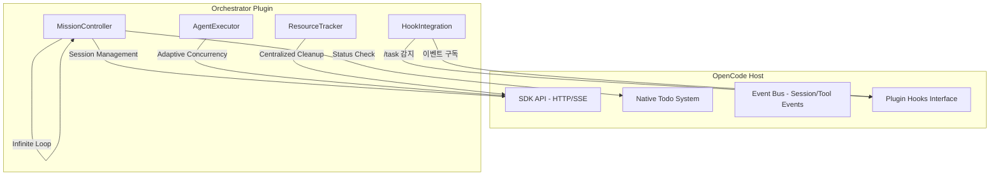

# OpenCode Orchestrator 통합 개선안 (Unified Design)

> **작성일**: 2026-01-27
> **현재 버전**: 1.2.21
> **목표**: OpenCode 네이티브 API로의 완전한 전이 + 무한 루프 & 병렬 최적화

---

## 1. 개요 및 철학

본 문서는 `개선안.md`와 `개선안2.md`를 하나로 통합한 최종 설계안입니다. 
핵심 철학은 **"OpenCode가 제공하는 인프라를 최대한 활용하고, Orchestrator는 고수준의 두뇌(Mission Control) 역할에 집중한다"**는 것입니다.

### 핵심 변화 요약
1. **Body (인프라)**: OpenCode Native API로 대체하여 중복 코드 2,500줄 삭제.
2. **Brain (제어)**: 무한 루프 보장 및 적응형 병렬 처리 도입으로 안정성 및 성능 극대화.
3. **Storage (상태)**: Orchestrator 자체 파일(.opencode/*.md) 대신 OpenCode 세션 데이터 활용.

---

## 2. 아키텍처 재설계

### 2.1 통합 구조도

---

## 3. 핵심 모듈별 개선 사항

### 3.1 MissionController (무한 루프 & 네이티브 Todo)

기존의 복잡한 `mission-loop.ts`와 `todo-manager.ts`를 하나로 통합합니다.

- **OpenCode Native Todo 활용**: `client.session.todo()`를 통해 현재 상태를 읽고, LLM이 `todowrite` 도구를 호출하도록 유도합니다.
- **Infinite Loop 보장**: `maxIterations` 제한을 사실상 제거하고(또는 매우 높게 설정), 모든 Todo가 완료되거나 LLM이 명시적으로 종료할 때까지 루프를 유지합니다.
- **스테그네이션 감지**: 동일한 Todo 상태가 3회 이상 지속될 경우, LLM에게 전략 수정을 요구하는 Intervention 프롬프트를 주입합니다.

### 3.2 AgentExecutor (적응형 병렬 처리)

여러 에이전트(Planner, Coder, Reviewer)를 동시에 돌리는 기능을 강화합니다.

- **Adaptive Concurrency**: 성공률과 지연시간에 따라 에이전트별 동시 실행 슬롯을 동적으로 조절합니다. (Min 2 ~ Max 10)
- **Session Reuse**: 기존 `SessionPool`을 강화하여 세션 생성 비용을 최소화하고, 전역 최대 세션 수(Global Max 30)를 안전하게 관리합니다.

### 3.3 ResourceTracker (리소스 회수)

분산되어 있던 cleanup 로직을 중앙화합니다.

- **중앙화된 추적**: 생성되는 모든 자식 세션, 타이머, 임시 리소스를 `ResourceTracker`에 등록합니다.
- **세션 기반 일괄 회수**: 메인 미션 세션이 종료되거나 삭제될 때, 연관된 모든 리소스를 100% 회수함을 보장합니다.

---

## 4. 제거 및 단순화 대상 (Clean-up)

불필요한 중복 인프라를 과감히 삭제합니다.

### 4.1 완전 삭제 대상 (~1,500줄)
| 경로 | 사유 |
|------|------|
| `src/core/todo/` | OpenCode SDK API로 대체 |
| `src/core/tui/` | OpenCode 내장 UI(Event Bus) 활용 |
| `src/core/cache/` | `src/core/memory/`와 통합하여 단순화 |
| `.opencode/*.md` | OpenCode 자체 DB로 관리되므로 불필요 |

### 4.2 단순화 대상
- `src/core/loop/`: 1,700줄 → 400줄 (MissionController로 통합)
- `src/hooks/`: 복잡한 위상 정렬 대신 OpenCode Native Hooks 인터페이스 활용.

---

## 5. 단계별 구현 계획

### 1단계: 기반 시스템 구축 (2일)
1. `ResourceTracker` 구현 및 적용.
2. `AdaptiveConcurrencyController` 구현.
3. OpenCode SDK 최신 버전(1.1.36+) 연동 확인.

### 2단계: MissionController 전환 (2일)
1. `MissionController` 신규 구현 (무한 루프 로직 포함).
2. `src/core/todo/` 의존성 제거 및 SDK API로 교체.
3. 기존 Loop Handler들을 `MissionController`로 리팩토링.

### 3단계: Hook 및 Entry Point 정리 (1일)
1. `src/index.ts`를 Native Hooks 중심으로 재작성.
2. `/task` 명령어 처리 흐름 최적화.

### 4단계: 안정화 및 파일 정리 (1일)
1. 중복 코드 및 구형 `.opencode` 파일 제거.
2. E2E 테스트를 통한 무한 루프 및 병렬 실행 검증.

---

## 6. 기대 효과

1. **유지보수성**: 코드 베이스가 약 40% 슬림해지며(순 감소 -2,500줄), OpenCode 업데이트에 기민하게 대응 가능.
2. **신뢰성**: 중앙화된 리소스 관리와 무한 루프 보장으로 미션 중단 현상 해결.
3. **사용자 경험**: OpenCode Native Todo UI와 완벽히 동기화되어 실시간 진행 상황을 더 정확하게 확인 가능.
